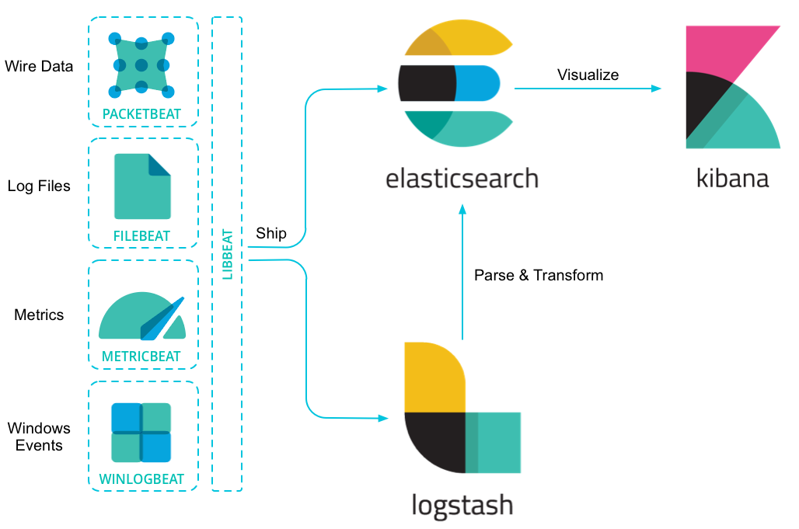

# Log Aggregation 

This Infrastructure is simple with components of Docker , Preconfigured with Opensource Tools

## Getting Started

These instructions will get you a copy of the project up and running on your local machine for development and testing purposes.



### Prerequisites

1. Docker for MAC/LINUX

```
Docker.dmg or rpm 
```

### Deploying the Stack

1. Clone this repository 

```
git clone https://github.com/thiru7kavi/Log_Collection_Monitoring.git
```

2. Navigate to LogAggregator directory

```
cd LogAggregator
```

3. Build and Deploy the stack

```
docker-compose up -d
```

### Testing the stack

Kibana and Elasticsearch are published to the HOST

```
http://localhost:9200
http://localhost:5601

```
Access/Hit this URL to create some logs in Apache 

```
http://localhost:8080
```

You can View Logs in

```
http://localhost:5601/app/infra#/logs?_g=()&logPosition=(position:(tiebreaker:10,time:1557128608354),streamLive:!f)

```
